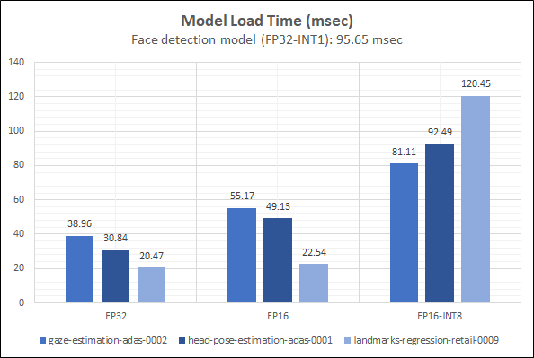

# Computer Pointer Controller
The objective for this project is to develop a python application to control the computer pointer (mouse pointer) through the eye ball movement. For the visualization purpose the pointer has been shown on the frame itself with small circle.

The proposed pipeline flow for this application is to use input from suitable pre-trained network models and finalize the mouse pointer position using gaze estimation model. Other models used in the flow are face detection (for primary area of focus), facial landmarks detection (for eye detection) and head pose estimation (for head pose angle).

## Project Set Up and Installation
Below are the project source structure, excluding the model files as it can be placed anywhere and passed as parameters

```
├── bin
│   └── demo.mp4
├── data
│   ├── fp32trace.log
│   ├── fp16trace.log
│   ├── fp16int8trace.log
│   ├── loadtime.png
│   ├── inferencetime.png
│   ├── demo.png
│   ├── app_flow.vsdx
│   ├── data_chart.xlsx
│   ├── application_flow_diagram.png
│   └── flow.png
├── README.md
├── requirements.txt
└── src
    ├── face_detection.py
    ├── facial_landmarks_detection.py
    ├── gaze_estimation.py
    ├── head_pose_estimation.py
    ├── input_feeder.py
    ├── app_main.py
    ├── utils.py
    └── mouse_controller.py
```

### Depenencies

This application depends on [intel-openvino-toolkit](https://software.intel.com/en-us/openvino-toolkit) and related libraries. First the openvino toolkit should be installed then the additional dependencies should be installed with the instructions given below.

All of the instructions are based on the validation on Ubuntu 18.04 LTS.

Move to the project workspace folder first:

    $ cd openvinotoolkit_prj3/

Create the virtual environment for this application with the below steps:

    $ python -m venv env
    $ source env/bin/activate

Create the environment setup for openvino and the application, as given below:

    $ source /opt/intel/openvino/bin/setupvars.sh -pyver 3.5
    $ pip install requests
    $ pip install -r requirements.txt

In case the webcam is planned to be used as input media then, on Ubuntu make sure that you have `v4l-utils` installed on the system. However it is optional step.

    $ sudo apt install v4l-utils

### Pre-Trained models used
After sourcing the environment the below commands can be used to download all required models. By default these model files will be downloaded under `./intel/` folder, if required we can use `-o` option to specify a custom path.

Below instructions are with the assumption that the `pwd` is the application source parent folder `project3_final`.

[Face Detection Model](https://docs.openvinotoolkit.org/latest/_models_intel_face_detection_adas_binary_0001_description_face_detection_adas_binary_0001.html)

    $ python /opt/intel/openvino/deployment_tools/tools/model_downloader/downloader.py --name "face-detection-adas-binary-0001"

This model takes the pre-processed media frame as input and provide the boundary box co-ordinates for the identified face. This application considers only the first face object co-ordinates.

[Facial Landmarks Detection Model](https://docs.openvinotoolkit.org/latest/_models_intel_landmarks_regression_retail_0009_description_landmarks_regression_retail_0009.html)
    
    $ python /opt/intel/openvino/deployment_tools/tools/model_downloader/downloader.py --name "landmarks-regression-retail-0009"

This model takes the pre-processed face frame as input and provide 5 face landmarks as (x,y) co-ordinates. This application considers only the first two landmarks as left and right eye center co-ordinates.

[Head Pose estimation Model](https://docs.openvinotoolkit.org/latest/_models_intel_head_pose_estimation_adas_0001_description_head_pose_estimation_adas_0001.html)

    $ python /opt/intel/openvino/deployment_tools/tools/model_downloader/downloader.py --name "head-pose-estimation-adas-0001"

This model takes the pre-processed face frame as input and provide YPR angles of the head pose. This application considers this as is to provide input to Gaze estimation model.

[Gaze detection Model](https://docs.openvinotoolkit.org/latest/_models_intel_gaze_estimation_adas_0002_description_gaze_estimation_adas_0002.html)

    $ python /opt/intel/openvino/deployment_tools/tools/model_downloader/downloader.py --name "gaze-estimation-adas-0002"

This model takes the pre-processes left and right eye frames along with YPR angles and provide gaze co-ordinates (x,y) based on the eye ball direction of movement. This application just passes this co-ordinates to MouseController which uses PyAutoGUI library.

After downloading these models the folder structure for the models folder will look similar to the given below.

```
└── intel
   ├── face-detection-adas-binary-0001
   │   └── FP32-INT1
   │       ├── face-detection-adas-binary-0001.bin
   │       └── face-detection-adas-binary-0001.xml
   ├── gaze-estimation-adas-0002
   │   ├── FP16
   │   │   ├── gaze-estimation-adas-0002.bin
   │   │   └── gaze-estimation-adas-0002.xml
   │   ├── FP16-INT8
   │   │   ├── gaze-estimation-adas-0002.bin
   │   │   └── gaze-estimation-adas-0002.xml
   │   └── FP32
   │       ├── gaze-estimation-adas-0002.bin
   │       └── gaze-estimation-adas-0002.xml
   ├── head-pose-estimation-adas-0001
   │   ├── FP16
   │   │   ├── head-pose-estimation-adas-0001.bin
   │   │   └── head-pose-estimation-adas-0001.xml
   │   ├── FP16-INT8
   │   │   ├── head-pose-estimation-adas-0001.bin
   │   │   └── head-pose-estimation-adas-0001.xml
   │   └── FP32
   │       ├── head-pose-estimation-adas-0001.bin
   │       └── head-pose-estimation-adas-0001.xml
   └── landmarks-regression-retail-0009
       ├── FP16
       │   ├── landmarks-regression-retail-0009.bin
       │   └── landmarks-regression-retail-0009.xml
       ├── FP16-INT8
       │   ├── landmarks-regression-retail-0009.bin
       │   └── landmarks-regression-retail-0009.xml
       └── FP32
           ├── landmarks-regression-retail-0009.bin
           └── landmarks-regression-retail-0009.xml
```

## Demo
After installing all ther required python modules and once the downloading of all the pre-trained models are placed in the appropriate place, below command will run this application.

    $ cd src/
    $ python app_main.py -m ../bin/demo.mp4 -fd ../intel/face-detection-adas-binary-0001/FP32-INT1/face-detection-adas-binary-0001.xml -fl ../intel/landmarks-regression-retail-0009/FP32/landmarks-regression-retail-0009.xml -hp ../intel/head-pose-estimation-adas-0001/FP32/head-pose-estimation-adas-0001.xml -ge ../intel/gaze-estimation-adas-0002/FP32/gaze-estimation-adas-0002.xml

If there is a need for output video created with visualization objects embedded then `-v` option can be passed as command line parameter.

If there is a need for live video playback then `-s` option can be passed as command line parameter.

Also, if there is a need for using different precision models then the `appropriate model file` can be passed as command line parameter.

Default stage of pipeline output would be as given below

    2020-09-23 17:35:40,889:INFO: Initializing the model ../intel/face-detection-adas-binary-0001/INT1/face-detection-adas-binary-0001.xml
    2020-09-23 17:35:40,890:INFO: Initializing the model ../intel/landmarks-regression-retail-0009/FP32/landmarks-regression-retail-0009.xml
    2020-09-23 17:35:40,891:INFO: Initializing the model ../intel/gaze-estimation-adas-0002/FP32/gaze-estimation-adas-0002.xml
    2020-09-23 17:35:40,892:INFO: Initializing the model ../intel/head-pose-estimation-adas-0001/FP32/head-pose-estimation-adas-0001.xml
    2020-09-23 17:35:40,936:INFO: Loading the model face-detection-adas-binary-0001.xml
    2020-09-23 17:35:41,177:INFO: Loading the model landmarks-regression-retail-0009.xml
    2020-09-23 17:35:41,224:INFO: Loading the model head-pose-estimation-adas-0001.xml
    2020-09-23 17:35:41,293:INFO: Loading the model gaze-estimation-adas-0002.xml
    2020-09-23 17:35:41,384:INFO: Starting the Media frame Loop...
    2020-09-23 17:37:02,903:INFO: End of Media frame Loop.

## Documentation
`Pipeline`: This project makes use of 4 pre-trained models provided by OpenVINO toolkit. The data flow between them is given below.

The above pipeline flow has been performed in the application main entry point (`app_main.py`).

```
    foreach media frame:
        │
        ├──Face Detection Model Inference: Input{Media Frame}, Output{Face Box}
        │
        ├──Head Pose Estimation Model Inference: Input{Face frame}, Output{Head Pose Angles}
        │  │
        └──├──Facial Landmarks Detection Model Inference: Input{Face frame}, Output{Left (x0,y0) and Right Eye (x1,y1)}
           │  │
           └──└───Gaze Estimation Model inference: Input{eyeframes, headposition angles}, Output{x,y, gaze_vector}
```

Below is the high level flow diagram for the entire application with the data points highlighted.


### Usage

Application Command Line Options:


## Benchmarks
The model load time and inference time has been captured and kept in data folder for various precisions and the below table summarizes the results. The below results are captured on a system with Intel Xeon multi core processor.

### Model Load Time comparison


### Inference Time comparison


## Results
As per the benchmark results run with different precision models, higher precision takes longer time when compared to lower precisions. The observation is, higher the precision the increases the accuracy of the model. In cases where there is a lesser accuracy is manageable then the suggestion would be to go for lower precision models which will be quicker is analysis due to quantization optimization using lower precision weights. In cases where higher accuracy is must then the suggestion would be to go for higher precision. Model accuracy and inference time is in the order of higher to lower precisions. Not all the pre-trained models, used in this application, has all the precisions, hence used only the available precisions for the comparison.

### Edge Cases
1. This application is implemented to handle only one face in the frame, if there are multiple faces then it will take input from only one face for controlling the mouse. Basically it is suitable only for certain cases where only one face is allowed.
2. When there is a poor lighting due to which the contrast of the face diminize then there is a chance that it will not detect the face and the output will not be robust.
3. Also, it has been noticed that for face detection and gaze estimation model without cpu extension the model gives unsupported layers while loading, hence the extension file parameter to the application has become mandatory.
